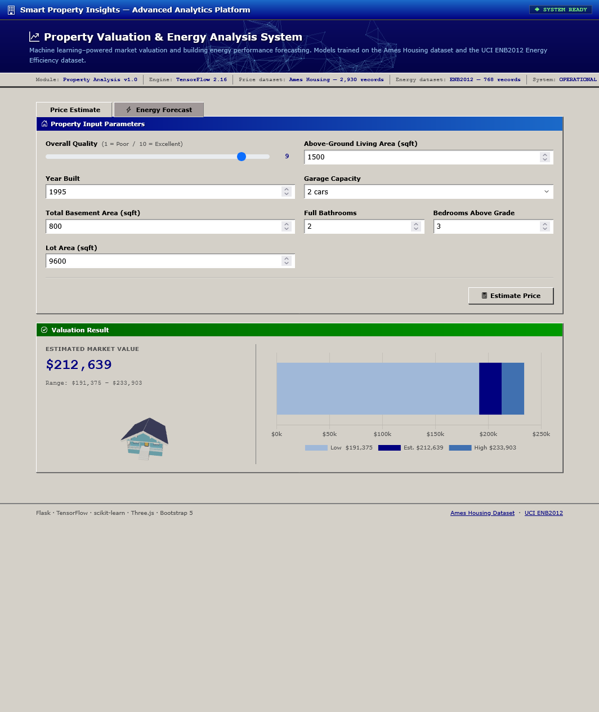
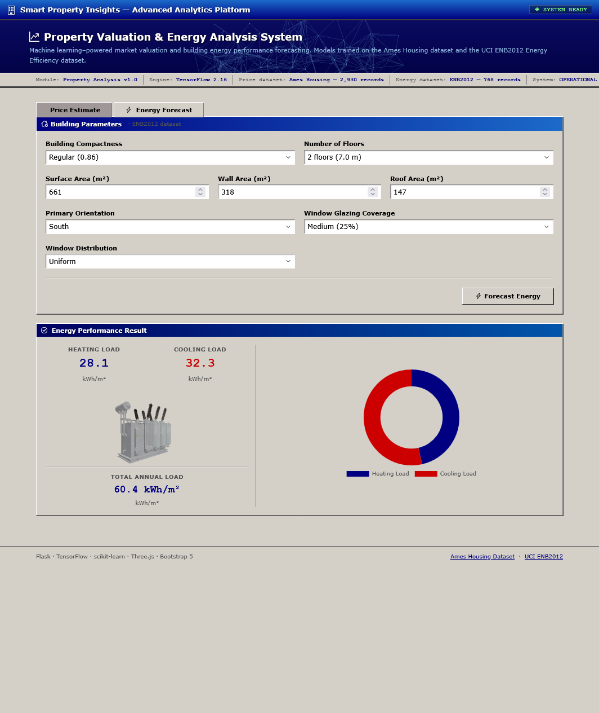

# Smart Property Insights

ML-powered web application for house price estimation and building energy consumption forecasting, deployed on AWS EC2 with a full CI/CD pipeline.

---

## Screenshots

| Property Valuation | Energy Forecast |
|---|---|
|  |  |

---

## Tech Stack

| Layer | Technology |
|---|---|
| Backend | Python 3.12, Flask, Gunicorn |
| ML | TensorFlow 2.16, scikit-learn |
| Database | SQLite + SQLAlchemy + Flask-Migrate |
| Frontend | Bootstrap 5, Chart.js, Three.js |
| Infrastructure | Docker, AWS EC2, AWS S3 |
| CI/CD | GitHub Actions (tests, Bandit, CodeQL, auto-deploy) |

**Datasets**
- [Ames Housing Dataset](https://www.kaggle.com/datasets/prevek18/ames-housing-dataset) — 2,930 records, house price regression
- [UCI ENB2012 Energy Efficiency](https://archive.ics.uci.edu/ml/datasets/Energy+efficiency) — 768 records, heating/cooling load regression

---

## Project Structure

```
├── app/
│   ├── api/                  # REST endpoints (/predict/price, /predict/energy, /health)
│   ├── models/               # SQLAlchemy models (prediction log)
│   ├── services/             # ML model loading and inference
│   └── static/               # Frontend (HTML, CSS, JS, Three.js scenes)
├── training/                 # Standalone training scripts and raw datasets
├── scripts/                  # Utility scripts (S3 upload, model download, vendor fetch)
├── tests/                    # Pytest test suite
├── migrations/               # Alembic database migrations
├── Dockerfile
├── docker-compose.yml
└── entrypoint.sh             # Container startup (S3 model sync → DB migrate → Gunicorn)
```

---

## Local Setup

```bash
# 1. Create and activate a virtual environment
python -m venv venv
venv\Scripts\activate        # Windows
# source venv/bin/activate   # macOS/Linux

# 2. Install dependencies
pip install -r requirements.txt

# 3. Download Three.js
python scripts/download_threejs.py

# 4. Configure environment
cp .env.example .env         # then fill in SECRET_KEY, AWS credentials, etc.

# 5. Apply database migrations
flask db upgrade

# 6. Run the development server
python run.py
```

---

## Deployment

The app runs on AWS EC2 behind Docker. Pushing to `main` triggers the GitHub Actions pipeline:

1. **CI** — runs pytest and Bandit security scan
2. **CodeQL** — static analysis on every push to main
3. **Deploy** — SSHs into EC2, pulls the latest code, rebuilds and restarts the container
